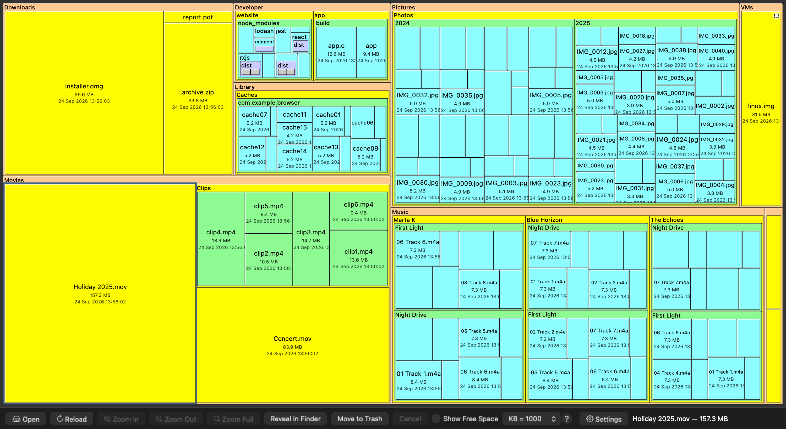

# SpaceMonger for macOS

A native macOS port of **SpaceMonger 1.4.0**, the classic Windows disk-space
visualizer by Sean Werkema (1998–2000). It shows a drive or folder as a nested
**treemap**: the bigger the box, the more disk space that file or folder uses,
so what's filling your disk is obvious at a glance.



It is written in Swift and AppKit and follows the original's C++ closely: the
same balanced-split layout, radix sort, colors, title bars, settings dialog,
tooltips and zoom animation — plus things a Mac needs, like APFS-aware sizes,
network shares and fast incremental reloads. The original's source is at
[seanofw/spacemonger1](https://github.com/seanofw/spacemonger1).

## Download

Get `SpaceMonger-<version>.zip` from the
[Releases](../../releases) page, unzip it and move **SpaceMonger.app** to
Applications. It runs on macOS 13 or later, on Apple Silicon and Intel Macs.

The app is **not notarized** (it is signed ad hoc, without an Apple developer
certificate), so macOS blocks the first launch. To open it anyway, either:

- try to open it, then go to **System Settings ▸ Privacy & Security** and click
  **Open Anyway**; or
- run once in Terminal: `xattr -dr com.apple.quarantine /Applications/SpaceMonger.app`

Or build it yourself — see below.

## Features

- **Treemap of any drive or folder**, laid out with the original's greedy
  balanced binary split and colored by depth. Folders get a title bar with
  their name; files show name, size and date when there's room.
- **Zoom** into any folder (double-click, `⌘]`), back out (`⌘[`) or to the top
  (`⌘0`), with a smooth zoom animation, the original's classic outline
  animation, or none. The window title shows where you are, and for a selection
  its path, share of the drive and size — like the original.
- **Fast scanning**: directories are read in bulk (`getattrlistbulk`) and in
  parallel. On an M-series Mac a whole 500 GB system disk (2.2 million files)
  scans in about 45 seconds.
- **Reload in under a second**: after a scan, macOS file-system events record
  which folders change, and Reload (`⌘R`) re-reads only those, keeping your
  zoom. *Reload “folder”* (`⌥⌘R`) rescans one folder; *Full Rescan* (`⇧⌘R`)
  starts over, like the original's Rescan Drive.
- **Network drives**: mounted SMB, AFP, NFS and WebDAV shares are listed and
  marked as network drives, and **Connect to Server…** mounts a new one
  (`smb://server/share`, or a Windows-style `\\server\share`) with the usual
  macOS sign-in and Keychain.
- **Sizes that match the disk**: boxes use the space actually allocated on disk
  (what `du` reports), not file lengths. **Sparse files** such as VM disk
  images get a small badge explaining why Finder shows a much bigger size.
- **Right-click menu**, **Properties**, **Reveal in Finder**, **Move to Trash**
  (can be disabled), and a free-space box for whole drives.
- **Settings** (`⌘,`) ported from the original: tile density, layout bias,
  color schemes for files and folders, file-name and file-info tips with
  delays, rollover highlighting, auto rescan, window position — plus decimal
  (Finder-style) or binary size units.

### Why sizes differ from Finder's Get Info

Boxes are sized by **space used on disk**. Get Info's headline figure is the
file's **length**; its "(… on disk)" figure is the comparable one. Small files
round up to whole disk blocks, while sparse, compressed and iCloud-evicted
files use less than their length. **Properties…** shows both numbers.

## Build from source

Requires macOS 13+ and Xcode or the Xcode Command Line Tools (Swift 5.9+).

```bash
git clone https://github.com/tanatosa/spacemonger-macos.git
cd spacemonger-macos
swift run                          # debug build
swift run SpaceMongerMac ~/Music   # scan a folder right away
```

For real scans use an optimized build — a debug build scans about 2× slower:

```bash
swift build -c release && ./.build/release/SpaceMongerMac
```

### Building the app

```bash
./make-release.sh                  # → dist/SpaceMonger.app and dist/SpaceMonger-1.0.0.zip
VERSION=1.1.0 ./make-release.sh    # also: BUILD_NUMBER, BUNDLE_ID, ARCHS, SIGN_IDENTITY
```

`make-release.sh` builds a universal (Apple Silicon + Intel) `SpaceMonger.app`
with its `Info.plist`, icon and resources, a zip of it, and a `.dSYM` for
reading crash reports. It signs **ad hoc**; set `SIGN_IDENTITY` to a
*Developer ID Application* certificate (and notarize) to distribute a build
that opens without the Gatekeeper steps above.

Pushing a tag like `v1.0.0` runs the same script on GitHub Actions and
publishes a release with the zip (`.github/workflows/release.yml`). The
workflow can also be run by hand from the Actions tab to just build and
download the app.

The app keeps its settings in `~/Library/Preferences/<bundle ID>.plist`
(`local.spacemonger.SpaceMongerMac` by default); `swift run` uses
`SpaceMongerMac.plist`.

## How it's built

| File | Role | Original counterpart |
|------|------|----------------------|
| `Scanner.swift` | Parallel bulk scan, incremental rescan, sizes, progress | `CFolderTree::LoadTree`, `CFolder::LoadFolder` |
| `ChangeTracker.swift` | FSEvents record of changed folders, for Reload | — |
| `TreemapLayout.swift` | Balanced-split layout, 8-bit radix sort | `CFolderView::SizeFolders`, `EightBitCountingSort` |
| `TreemapView.swift` | Drawing, hit-testing, labels, tips, rollover, zoom animations | `CFolderView` |
| `TipWindow.swift` | Name and info tip windows | `CTipWnd` |
| `MainWindowController.swift` | Window, toolbar, title, menus, file actions | `CMainFrame` |
| `DriveDialog.swift` | Drive picker, Connect to Server | `CDriveDialog` |
| `ScanDialog.swift` | Scan progress window | `CFolderDialog` |
| `SettingsDialog.swift`, `Settings.swift` | Settings dialog and stored options | `CSettingsDialog`, `CCurrentSettings` |
| `Palette.swift` | Color schemes | `BoxColors`, `FixedColors` |
| `Models.swift` | `Node` tree (value types), size formatting | `CFolder` |

Performance follows the original's ideas: one bulk read per directory (its
single `FindFirstFile` pass), each folder sorted by an O(n) 8-bit radix sort as
soon as it's read (`Finalize`), a packed value-type tree, and a minimum tile
size (the density setting, `minsizes[]`) below which folders aren't subdivided.
Scans skip symbolic links and other volumes' mount points, and count APFS
firmlinked folders (`/Users`, `/Applications`, …) exactly once.

## Differences from the original

- No French translation (English only).
- Move to Trash asks first; the original deleted to the Recycle Bin without
  confirmation.
- Double-clicking a file doesn't open it (use Open in the right-click menu).
- The scan window shows a progress bar without the original's animation.

## License

MIT — see [LICENSE](LICENSE). The original SpaceMonger is © 1998–2020 Sean
Werkema; this port © 2026 Nikolay Atanasov. The app icon is the original
SpaceMonger icon.
